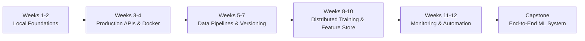
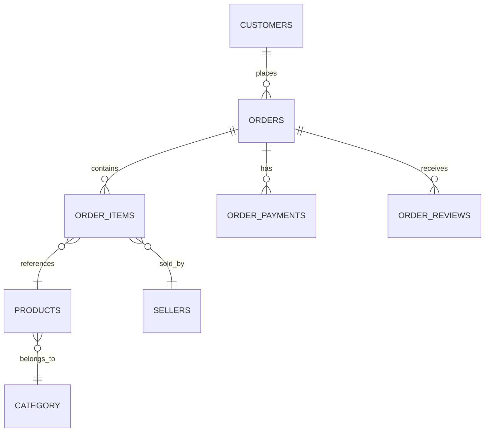
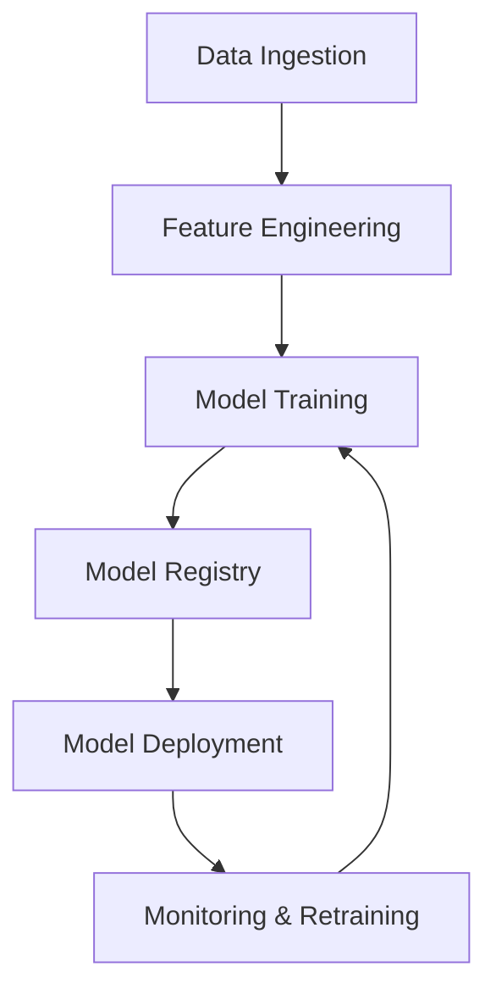

# MLOps Engineering Training Program

## Qafza Tech — 12-Week Applied Program

Welcome to the **MLOps Engineering** training program by **[Qafza Tech](https://www.qafzatech.com)** . This hands-on journey takes you from local development to production-grade ML systems, using the Olist Brazilian E-Commerce dataset as our real-world case study.

---

## About Qafza Tech

**Qafza Tech** is a leading data and AI academy in the Middle East, trusted by **5,000+ trainees** and **20+ companies** including STC, Saudi Aramco, SDAIA, and Microsoft. With a **4.8/5 trainee rating**, Qafza delivers practical training that bridges the gap between learning and employment.

> *"From zero to job-ready — real projects, certified training, and career launch support."*

---

## Program Overview

### The Challenge
Predict whether an e-commerce order will be **delivered late or on time** — a critical business problem that impacts customer satisfaction and operational efficiency.

### The Journey
Over **12 intensive weeks**, you'll build an end-to-end ML system:



---

## Weekly Curriculum

| Week | Phase | Dates | Topic | Focus Area |
|------|-------|-------|-------|------------|
| **Week 1** | Local Foundations | 20–27 Jul 2026 | **Leakage-proof ML Pipeline** | Build robust pipelines that prevent data leakage, ensuring model integrity from day one. |
| **Week 2** | Local Foundations | 27 Jul – 3 Aug 2026 | **Deep Learning Pipeline** | Extend your pipeline with neural network architectures using PyTorch/TensorFlow. |
| **Week 3** | Production APIs | 3–10 Aug 2026 | **Production API** | Create FastAPI/Flask endpoints to serve your model as a RESTful service. |
| **Week 4** | Containerization | 10–17 Aug 2026 | **Docker** | Containerize your application, ensuring consistency across development and production. |
| **Week 5** | Data Pipelines | 17–24 Aug 2026 | **ETL Pipeline** | Design robust Extract-Transform-Load workflows using tools like Airflow or Prefect. |
| **Week 6** | Data Versioning | 24–31 Aug 2026 | **Versioning** | Implement DVC to version datasets, ensuring reproducibility and collaboration. |
| **Week 7** | Experiment Tracking | 31 Aug – 7 Sep 2026 | **MLflow** | Track experiments, log parameters, metrics, and artifacts for complete reproducibility. |
| **Week 8** | Distributed Training | 7–14 Sep 2026 | **Distributed ML** | Scale training across multiple GPUs/nodes using Ray, Horovod, or PyTorch Distributed. |
| **Week 9** | Feature Store | 14–21 Sep 2026 | **Feature Management** | Build and manage a feature store (Feast/Hopsworks) for online/offline serving. |
| **Week 10** | Monitoring | 21–28 Sep 2026 | **Monitoring** | Implement model and data drift monitoring using Prometheus/Grafana or Evidently AI. |
| **Week 11** | Continuous Retraining | 28 Sep – 5 Oct 2026 | **Automation** | Build automated retraining pipelines triggered by data drift or schedule. |
| **Week 12** | Infrastructure as Code | 5–12 Oct 2026 | **Infrastructure** | Define cloud infrastructure using Terraform/Pulumi for reproducible deployment. |
| **Final** | Capstone | 12–19 Oct 2026 | **End-to-End ML System** | Integrate all components into a complete, production-ready ML system. |

---

## Technology Stack

### Core Technologies by Phase

| Phase | Technologies |
|-------|-------------|
| **Foundations** | Python, Pandas, NumPy, Scikit-learn, Jupyter |
<!-- | **Deep Learning** | PyTorch, TensorFlow, Keras |
| **APIs & Deployment** | FastAPI, Flask, Gunicorn, NGINX | -->
| **Containerization** | Docker, Docker Compose |
<!-- | **Data Pipelines** | Apache Airflow, Prefect, Dagster |
| **Versioning** | DVC (Data Version Control), Git LFS |
| **Experiment Tracking** | MLflow, Weights & Biases |
| **Distributed Training** | PyTorch Distributed, Ray, Horovod |
| **Feature Store** | Feast, Hopsworks, Featureform |
| **Monitoring** | Prometheus, Grafana, Evidently AI, WhyLabs | -->
| **CI/CD** | GitHub Actions |
<!-- | **Infrastructure** | Terraform, Pulumi, AWS CDK | -->
<!-- 
### Python Ecosystem

```python
# Core
pandas>=2.0.0
numpy>=1.24.0
scikit-learn>=1.3.0
python-dotenv>=1.0.0

# Deep Learning
torch>=2.0.0
tensorflow>=2.13.0

# MLOps
mlflow>=2.5.0
dvc>=3.0.0
prefect>=2.0.0
feast>=0.33.0
evidently>=0.3.0

# API & Web
fastapi>=0.100.0
uvicorn>=0.23.0
pydantic>=2.0.0

# Infrastructure
boto3>=1.28.0
terraform>=1.5.0

# Testing & Quality
pytest>=7.4.0
black>=23.0.0
flake8>=6.1.0
``` -->

---

## Project: Olist Delivery Prediction

### Dataset Overview

The **Olist Brazilian E-Commerce Dataset** contains real marketplace data:
<!-- 


### Key Statistics

| Table | Size | Purpose |
|-------|------|---------|
| orders | 100,000+ | Main transaction records |
| customers | 100,000+ | Customer profiles |
| order_items | 110,000+ | Line items per order |
| products | 30,000+ | Product catalog |
| sellers | 3,000+ | Seller information |
| order_payments | 100,000+ | Payment transactions |
| order_reviews | 100,000+ | Customer feedback |
| geolocation | 1,000,000+ | Location coordinates |

### Business Impact

**Customer Satisfaction** — Reduce late deliveries and improve customer experience  
**Operational Efficiency** — Proactively address logistics bottlenecks  
**Revenue Protection** — Minimize refunds and chargebacks due to delivery issues  
**Scalable Solution** — Framework applicable to other e-commerce platforms

---

## Key Learning Outcomes

### Technical Skills
- Build **production-ready ML pipelines** with proper data validation
- Implement **API services** for model serving
- **Containerize** applications using Docker
- Design **ETL/ELT data pipelines** using modern orchestration tools
- Version **data, code, and models** for full reproducibility
- Track **experiments** to compare and select optimal models
- Scale training with **distributed computing**
- Build and manage **feature stores**
- Implement **monitoring** for data and model drift
- Automate **retraining pipelines**
- Deploy infrastructure using **Infrastructure as Code (IaC)**

### Professional Competencies
- **System Design** — Architect complete ML systems
- **Data Engineering** — Build robust data pipelines
- **Model Development** — Create and optimize ML models
- **DevOps Practices** — Containerization, CI/CD, and monitoring
- **Documentation** — Create clear technical documentation
- **Collaboration** — Work with version control and team workflows
- **Problem Solving** — Address real-world business challenges

---
-->
## Capstone Project

### Final Deliverable: End-to-End ML System

Integrate all 12 weeks of learning into a complete solution:



### Capstone Requirements

| Component | Description |
|-----------|-------------|
| **Data Pipeline** | Automated ETL from raw CSV to feature store |
| **Feature Store** | Online/offline serving with Feast |
| **Model Training** | Automated retraining pipeline |
| **Experiment Tracking** | MLflow with full parameter logging |
| **Model Registry** | Versioned model artifacts |
| **API Service** | FastAPI with prediction endpoints |
| **Containerization** | Dockerized application |
| **CI/CD** | GitHub Actions pipeline |
| **Monitoring** | Data drift + model performance dashboards |
| **Infrastructure** | Terraform-defined deployment | 

---

### Program Strengths

- **Structured Curriculum** — Week-by-week progression
- **Expert Instructors** — Industry professionals with real experience
- **Job-Ready Skills** — Focus on practical, in-demand tools
- **Certification** — Recognized credential upon completion
- **Community** — Join 5,000+ alumni network
- **Employment Support** — Connection to hiring partners

---

## Getting Started

### Prerequisites

| Skill | Level |
|-------|-------|
| Python | Intermediate |
| SQL | Basic |
| Git | Basic |
| Linux/Command Line | Basic |

### Hardware Requirements

- 8GB+ RAM (16GB recommended)
- 50GB free disk space
- GPU optional (cloud resources provided)

## Program Timeline at a Glance

```
Week 1-2  ████████░░░░░░░░  Local Foundations (ML Pipeline + Deep Learning)
Week 3-4  ░░████████░░░░░░  Production APIs & Containerization
Week 5-6  ░░░░░████████░░░░  Data Pipelines & Versioning
Week 7-8  ░░░░░░░░████████  Experiment Tracking & Distributed Training
Week 9-10 ░░░░░░░░░░░██████  Feature Store & Monitoring
Week 11-12░░░░░░░░░░░░░░████  Retraining & Infrastructure
Capstone  ░░░░░░░░░░░░░░░░██████  End-to-End ML System
```

---

## License

This training program is proprietary to Qafza Tech. Materials are provided for educational purposes only.